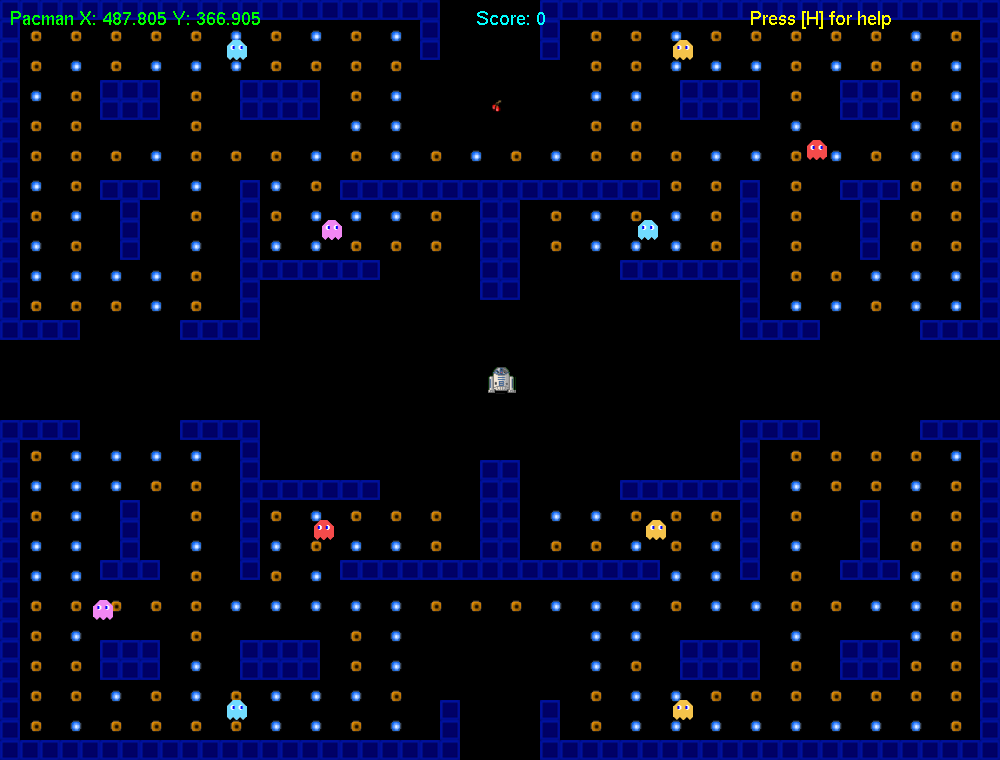

# Pac-Man Game

&nbsp;

&nbsp;

&nbsp;

A "Pac-Man" replica game created as part of for FOGGS module in year 1 at university.

*- Click <a href="https://kyle-robinson.github.io/html/pacman" target="_blank">here</a> for more information on website -*

<!--  -->

https://user-images.githubusercontent.com/39779606/223290399-ebf141c2-93a3-456e-80f1-437e0da431f8.mp4

## List of Features

- [x] Ghost A.I.
- [x] Wall-Wrapping
- [x] Collisions
- [x] Level Map
- [x] Scoring System

## Getting Started

Refer to the following information on how to install and use the application.

### Dependencies
To use the application, the following prerequisites must be met.
* Windows 10+
* Visual Studio
* Git Version Control

The application relies on the following libraries and APIs to function.
* S2D

### Installing

To download a copy of the application, select "Download ZIP" from the main code repository page, or create a fork of the project. More information on forking a GitHub respository can be found [here](https://www.youtube.com/watch?v=XTolZqmZq6s).

### Executing program

There are no additional steps required to execute the application.

---

### Credits

        Sprites
            https://www.gameart2d.com/freebies.html
            https://www.spriters-resource.com/arcade/pacman/
